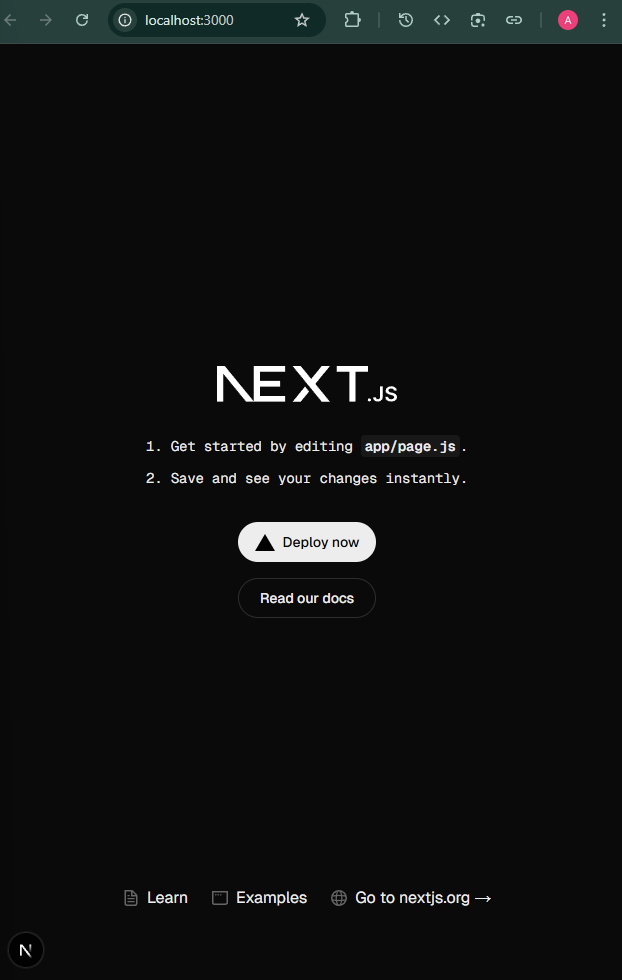

# Portfolio Website - NextJS

## ProjectSetup & Commands run or used

- Reference Docs:
  - [Create a new Next.js app and run it locally.](https://nextjs.org/docs/app/getting-started/installation)

```bash
C:\Users\abhis\Desktop\NextJs Projects\portfolio>pnpm create next-app@latest .
√ Would you like to use TypeScript? ... No / Yes #No
√ Which linter would you like to use? » ESLint
√ Would you like to use Tailwind CSS? ... No / Yes #Yes
√ Would you like your code inside a `src/` directory? ... No / Yes #No
√ Would you like to use App Router? (recommended) ... No / Yes #Yes
√ Would you like to use Turbopack? (recommended) ... No / Yes #Yes
√ Would you like to customize the import alias (`@/*` by default)? ... No / Yes #No
Creating a new Next.js app in C:\Users\abhis\Desktop\NextJs Projects\portfolio.

Using pnpm.

Initializing project with template: app-tw


Installing dependencies:
- react
- react-dom
- next

Installing devDependencies:
- @tailwindcss/postcss
- tailwindcss
- eslint
- eslint-config-next
- @eslint/eslintrc


   ╭──────────────────────────────────────────╮
   │                                          │
   │   Update available! 10.10.0 → 10.15.1.   │
   │   Changelog: https://pnpm.io/v/10.15.1   │
   │     To update, run: pnpm self-update     │
   │                                          │
   ╰──────────────────────────────────────────╯

Downloading next@15.5.2: 30.29 MB/30.29 MB, done
Downloading @next/swc-win32-x64-msvc@15.5.2: 46.48 MB/46.48 MB, done
Packages: +320
++++++++++++++++++++++++++++++++++++++++++++++++++++++++++++++++++++++++++++++++++++++++++++++++++++++++++++++++++++++
Progress: resolved 391, reused 303, downloaded 22, added 320, done

dependencies:
+ next 15.5.2
+ react 19.1.0 (19.1.1 is available)
+ react-dom 19.1.0 (19.1.1 is available)

devDependencies:
+ @eslint/eslintrc 3.3.1
+ @tailwindcss/postcss 4.1.13
+ eslint 9.35.0
+ eslint-config-next 15.5.2
+ tailwindcss 4.1.13

Done in 30.4s using pnpm v10.10.0
Success! Created portfolio at C:\Users\abhis\Desktop\NextJs Projects\portfolio


C:\Users\abhis\Desktop\NextJs Projects\portfolio>pnpm approve-builds
√ Choose which packages to build (Press <space> to select, <a> to toggle all, <i> to invert selection) · @tailwindcss/oxide, sharp, unrs-resolver

√ The next packages will now be built: @tailwindcss/oxide, sharp, unrs-resolver.
Do you approve? (y/N) · true
node_modules/.pnpm/@tailwindcss+oxide@4.1.13/node_modules/@tailwindcss/oxide: Running postinstall script, done in 443ms
node_modules/.pnpm/unrs-resolver@1.11.1/node_modules/unrs-resolver: Running postinstall script, done in 271ms
node_modules/.pnpm/sharp@0.34.3/node_modules/sharp: Running install script, done in 307ms
```

- To Start the server:

```bash
abhis@Tinku MINGW64 ~/Desktop/NextJs Projects/portfolio (main)
$ pnpm dev

> portfolio@0.1.0 dev C:\Users\abhis\Desktop\NextJs Projects\portfolio
> next dev --turbopack

   ▲ Next.js 15.5.2 (Turbopack)
   - Local:        http://localhost:3000
   - Network:      http://192.168.29.186:3000

 ✓ Starting...
 ✓ Ready in 14.3s
 ○ Compiling / ...
 ✓ Compiled / in 20.7s
 GET / 200 in 22269ms
 ○ Compiling /favicon.ico ...
 ✓ Compiled /favicon.ico in 854ms
 GET /favicon.ico?favicon.0b3bf435.ico 200 in 1429ms
```

- Our App looks like:
  
